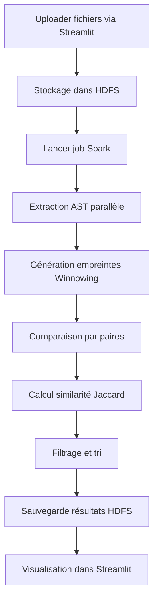

# 📁 Structure Complète du Projet

```
CodePlagiat/
│
├── 📄 README.md                          # Documentation principale
├── 📄 QUICKSTART.md                      # Guide de démarrage rapide
├── 📄 ARCHITECTURE.md                    # Architecture détaillée
├── 📄 LICENSE                            # Licence MIT
├── 📄 .gitignore                         # Fichiers à ignorer par Git
├── 📄 Makefile                           # Commandes rapides
├── 📄 docker-compose.yml                 # Orchestration Docker
│
├── 🐳 docker/                            # Fichiers Docker
│   ├── Dockerfile.base                   # Image de base (Spark/Hadoop/Python)
│   ├── Dockerfile.client                 # Image client (Streamlit)
│   ├── entrypoint.sh                     # Script de démarrage conditionnel
│   └── requirements.txt                  # Dépendances Python
│
├── ⚙️ configs/                           # Configurations
│   ├── hdfs-site.xml                     # Configuration HDFS
│   └── spark-defaults.conf               # Configuration Spark
│
├── 💻 src/                               # Code source
│   ├── __init__.py
│   │
│   ├── 🔥 spark_jobs/                    # Jobs PySpark
│   │   ├── __init__.py
│   │   ├── detect_plagiarism.py          # Job principal de détection
│   │   ├── ast_extractor.py              # Extraction AST
│   │   ├── winnowing.py                  # Algorithme Winnowing
│   │   └── similarity.py                 # Calcul de similarité
│   │
│   ├── 🌐 client/                        # Application Web
│   │   ├── __init__.py
│   │   └── app.py                        # Interface Streamlit
│   │
│   └── 🔧 utils/                         # Utilitaires
│       ├── __init__.py
│       ├── hdfs_utils.py                 # Utilitaires HDFS
│       └── spark_utils.py                # Utilitaires Spark
│
└── 📊 data/                              # Données
    ├── input/                            # Fichiers sources à analyser
    │   ├── example1.py                   # Exemple Python 1
    │   ├── example2.py                   # Exemple Python 2
    │   └── example3.py                   # Exemple Python 3
    ├── output/                           # Résultats d'analyse
    │   └── .gitkeep
    └── logs/                             # Logs système
        └── .gitkeep
```

## 📝 Description des Fichiers Clés

### 🐳 Docker

**docker-compose.yml**
- Définit 4 services : Master, Worker1, Worker2, Client
- Configure les réseaux et volumes persistants
- Gère les dépendances et health checks

**docker/Dockerfile.base**
- Image complète avec Java 11, Hadoop 3.3.1, Spark 3.3.0
- Python 3.9 + dépendances (PySpark, tree-sitter)
- Compilateurs C++/Java pour analyse AST
- Taille finale : ~2.5 GB

**docker/entrypoint.sh**
- Gère le démarrage conditionnel (Master/Worker/Client)
- Initialise HDFS NameNode sur le Master
- Démarre les services Spark selon le rôle

### ⚙️ Configuration

**configs/hdfs-site.xml**
- Configuration HDFS distribuée
- Réplication : 1 (dev) / 3 (prod)
- Taille de bloc : 128 MB
- Permissions désactivées (dev)

**configs/spark-defaults.conf**
- Ressources : 2GB/executor, 2 cores/executor
- Parallélisme : 4
- Event logs activés
- Compression des données

### 💻 Code Source

**src/spark_jobs/detect_plagiarism.py** (300+ lignes)
- Job PySpark principal
- Pipeline complet : lecture → AST → winnowing → comparaison → sauvegarde
- Arguments : --input, --output, --master
- Logging détaillé et gestion d'erreurs

**src/spark_jobs/ast_extractor.py** (230+ lignes)
- Extraction de tokens depuis code source
- Support : Python (natif), C++, Java (regex)
- Normalisation et nettoyage
- Option d'intégration avec tree-sitter

**src/spark_jobs/winnowing.py** (250+ lignes)
- Algorithme Winnowing complet
- Génération de k-grams (k=5)
- Fenêtre glissante (w=4)
- Hashing MD5 pour robustesse

**src/spark_jobs/similarity.py** (270+ lignes)
- Métrique Jaccard (principale)
- Autres métriques : Cosine, Dice, Containment
- Catégorisation de similarité
- Comparaison détaillée et batch

**src/client/app.py** (400+ lignes)
- Interface Streamlit complète
- Upload de fichiers vers HDFS
- Soumission de jobs Spark
- Visualisation avec Plotly
- Export CSV des résultats

**src/utils/hdfs_utils.py** (150+ lignes)
- Client HDFS Python
- Opérations : upload, download, list, delete
- Upload récursif de répertoires

**src/utils/spark_utils.py** (100+ lignes)
- Création de SparkSession
- Utilitaires de configuration
- Monitoring et debugging

### 📊 Données

**data/input/example*.py**
- Exemples de code Python
- example1.py et example2.py : similaires (factorielle)
- example3.py : différent (tri à bulles)
- Permet de tester immédiatement le système

## 🎯 Points d'Entrée

### 1. Interface Web (Recommandé)
```bash
# Accéder à l'application
http://localhost:8501
```

### 2. Ligne de Commande
```bash
# Soumettre un job directement
docker exec spark-master spark-submit \
  --master spark://spark-master:7077 \
  /app/src/spark_jobs/detect_plagiarism.py
```

### 3. Shell PySpark Interactif
```bash
# Pour tester et débugger
docker exec -it spark-master pyspark \
  --master spark://spark-master:7077
```

## 📦 Volumes Docker

**Volumes persistants créés automatiquement :**
- `spark-master-data` : Métadonnées HDFS NameNode
- `spark-worker-1-data` : Données HDFS Worker 1
- `spark-worker-2-data` : Données HDFS Worker 2
- `spark-logs` : Logs Spark partagés

**Volumes montés depuis l'hôte :**
- `./src` → `/app/src` : Code source (modifiable à chaud)
- `./data` → `/app/data` : Données locales
- `./configs` → `/app/configs` : Configurations

## 🌐 Ports Exposés

| Port | Service | Description |
|------|---------|-------------|
| 8501 | Streamlit | Interface Web principale |
| 8080 | Spark Master | WebUI Master |
| 8081 | Spark Worker 1 | WebUI Worker 1 |
| 8082 | Spark Worker 2 | WebUI Worker 2 |
| 7077 | Spark Master | Communication RPC |
| 9000 | HDFS NameNode | Communication RPC |
| 9870 | HDFS NameNode | WebUI HDFS |
| 9864 | HDFS DataNode 1 | DataNode 1 |
| 9865 | HDFS DataNode 2 | DataNode 2 |

## 🔍 Metrics & Monitoring

### Spark Master UI (http://localhost:8080)
- Workers actifs
- Applications en cours
- Ressources allouées
- Historique des jobs

### HDFS NameNode UI (http://localhost:9870)
- Espace disque utilisé/disponible
- Nombre de DataNodes actifs
- Browsing du système de fichiers
- Santé du cluster

### Streamlit (http://localhost:8501)
- Upload et gestion des fichiers
- Lancement et suivi des analyses
- Visualisation des résultats
- Export des rapports

## 🚀 Workflow Complet



## 📈 Taille des Fichiers

| Fichier | Lignes | Taille |
|---------|--------|--------|
| detect_plagiarism.py | ~350 | ~15 KB |
| ast_extractor.py | ~230 | ~9 KB |
| winnowing.py | ~250 | ~10 KB |
| similarity.py | ~270 | ~12 KB |
| app.py | ~400 | ~18 KB |
| Dockerfile.base | ~200 | ~8 KB |
| docker-compose.yml | ~200 | ~7 KB |
| **TOTAL Code** | **~2000** | **~80 KB** |

## 🎓 Pour Aller Plus Loin

### Améliorations Possibles

1. **Algorithmes avancés**
   - LSH (Locality-Sensitive Hashing) pour scalabilité
   - Graphes de dépendances de code
   - Détection de refactoring

2. **Features supplémentaires**
   - Support de plus de langages (Go, Rust, TypeScript)
   - Détection de patterns spécifiques (design patterns)
   - Analyse de similarité sémantique (embeddings)

3. **Infrastructure**
   - Déploiement Kubernetes
   - Auto-scaling des workers
   - Monitoring avec Prometheus/Grafana

4. **Interface**
   - API REST pour intégration
   - Dashboard temps réel
   - Rapports PDF détaillés

### Ressources

- 📚 [Documentation Apache Spark](https://spark.apache.org/docs/latest/)
- 🎓 [Cours Spark sur Coursera](https://www.coursera.org/learn/scala-spark-big-data)
- 📖 [Winnowing Algorithm Paper](https://theory.stanford.edu/~aiken/publications/papers/sigmod03.pdf)
- 💡 [GitHub - Awesome Spark](https://github.com/awesome-spark/awesome-spark)

---

**Version:** 1.0  
**Date:** November 2025  
**Auteur:** CodePlagiat Project  
**Licence:** MIT
